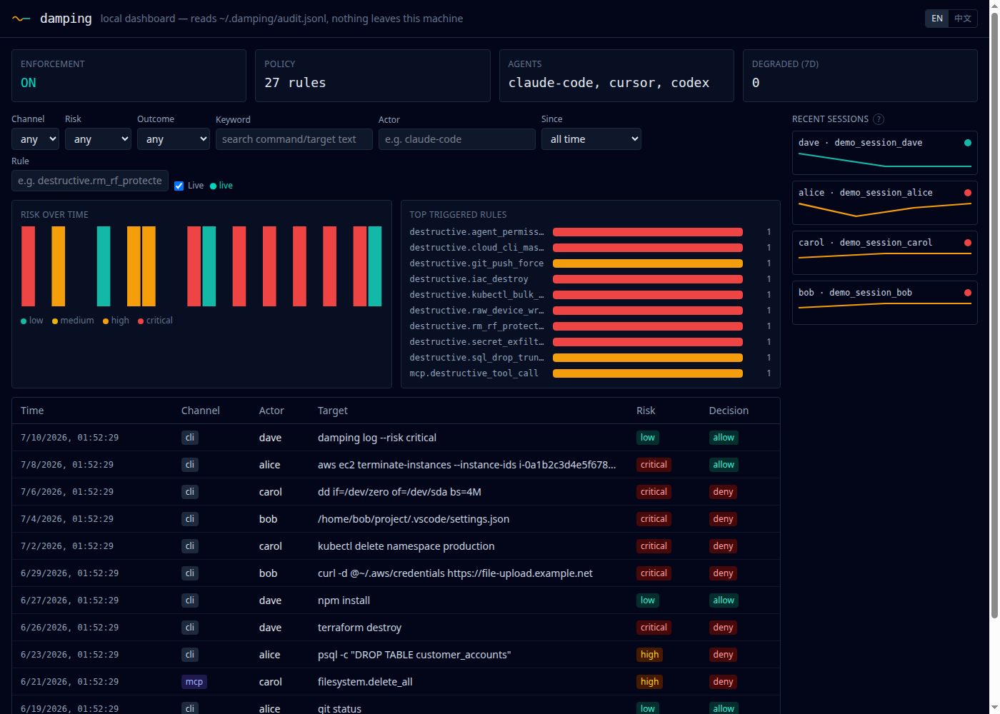

# Damping

**English** | [繁體中文](README.zh-TW.md)

**One policy. One audit trail. Across your terminal and your MCP servers.**

Damping sits between your AI coding agent (Claude Code, Cursor, Codex, and more to come) and the real world. Before a destructive shell command or a risky MCP tool call actually runs, Damping checks it against a policy engine and gives you the chance to say no — and it writes down what happened either way, in one place, regardless of which channel the action came through.

```
⚠  Damping intercepted a destructive command

  Command: rm -rf ~/
  Rule:    destructive.rm_rf_protected
  Reason:  Recursive+force delete of a path that isn't a known regenerable build/cache directory (node_modules, dist, build, ...) — for your home directory, filesystem root, or a configured protected path, this could destroy irreplaceable data

  [a] Allow once   [A] Always allow this exact command
  [d] Deny once    [D] Always deny this exact command
>
```

## Physics, briefly

*Damping* (阻尼), in physics, is the force that suppresses runaway oscillation and brings a system back to a stable range — it doesn't stop the system, it stabilizes it. That's the whole product philosophy: **governance isn't about blocking your AI agent. It's about damping its failure modes so it runs stably.** (Part of Amplify Lab's physics-themed product family.)

## Quick start

### 1. Install and set up

```
curl -fsSL https://raw.githubusercontent.com/amplify-lab/damping/main/install.sh | sh
damping init                # detects Claude Code / Cursor / Codex, installs the default policy, registers hooks
```

Homebrew is now live too — `brew install amplify-lab/tap/damping` (a custom tap, not `homebrew-core`, so the `amplify-lab/tap` prefix is required; a bare `brew install damping` will never resolve to this cask). `curl -sSL https://damping.dev/install | sh` still isn't — see "Deploying Damping" below for exactly what's still missing there. All three install the same real, checksum-verified binary from the same GitHub Release.

`damping init` prints a confirmation for every agent it found and wired up, and closes with a one-line demo suggestion (`ask your agent to run rm -rf /tmp/test`) — that's step 2 below.

### 2. Watch it intercept something

Ask your agent (Claude Code, Cursor, Codex) to run something Damping's default policy treats as destructive — `rm -rf /tmp/test` is the safe way to see this without risking real data. You'll see this at your terminal, not in the agent's own chat window (Damping owns its own confirmation prompt on `/dev/tty`, independent of whichever agent triggered it):

```
⚠  Damping intercepted a destructive command

  Command: rm -rf ~/
  Rule:    destructive.rm_rf_protected
  Reason:  Recursive+force delete of a path that isn't a known regenerable build/cache directory (node_modules, dist, build, ...) — for your home directory, filesystem root, or a configured protected path, this could destroy irreplaceable data

  [a] Allow once   [A] Always allow this exact command
  [d] Deny once    [D] Always deny this exact command
>
```

- **`a`** / **`d`** decide just this one call.
- **`A`** / **`D`** persist the decision (an exact-match pattern written into your policy file) so the same command never prompts again — useful once you've confirmed a repeated command in your workflow (e.g. `rm -rf ./dist/*` in a build script) is actually fine.

### 3. Review what happened

Every action Damping evaluates — allowed, prompted, or denied, on either channel — lands in one audit trail:

```
damping log                        # replay everything it's intercepted, across every channel
damping log --risk critical        # just the critical-severity events
damping log --channel mcp --since 24h
damping log --follow               # tail -f style, live
```

Or open the same log in a local, zero-setup web view:

```
damping dashboard                  # binds to 127.0.0.1:4243 by default
```



*(Real output from a seeded local audit log — not a mockup. Rows span both channels, all four risk tiers, both allow/deny/prompt outcomes, and two different agents, which is the whole point: one table, not one per tool.)*

### 4. Cover your MCP servers too

Point your MCP client config at Damping instead of the real server directly:

```
damping mcp wrap -- npx @some-org/example-mcp-server
```

Damping discovers the real server's tools, re-exposes them unchanged, and runs every call through the exact same policy engine and audit log as your terminal — before forwarding it on. Nothing about the wrapped server's behavior changes from the client's point of view except that a destructive tool call can now be intercepted, exactly like a shell command.

## Command reference

Every command below also accepts a global `--config PATH` flag to point at a policy file other than the default (`~/.damping/policy.yaml`). This is the everyday surface — every flag, in full, is documented in [`docs/cli-reference.md`](docs/cli-reference.md).

**Setup & status**

| Command | What it does |
| --- | --- |
| `damping init [--lang en\|zh-TW]` | One-time setup — detects Claude Code / Cursor / Codex, installs the default policy, registers hooks. Never overwrites an existing policy file; `damping init --force` refreshes it to the current default (overwrites the whole file). On a fresh install it also asks (interactively, or via `--lang`) which language the TTY confirmation prompt and `policy test` render in — English or 繁體中文, all 27 rules already translated |
| `damping status` | Is it on, which policy file, which agents are actually wired up |
| `damping doctor` | Health check — hook registration, policy validity, degraded-mode history. Exit code 4 if anything's wrong — the one command worth scripting into an onboarding check or CI |
| `damping on` | Re-enable enforcement |
| `damping off [--for 30m]` | Pause enforcement — the only sanctioned way to disable Damping (see [`docs/threat-model.md`](docs/threat-model.md) §4) |
| `damping version` | Print the installed version |

**Policy**

| Command | What it does |
| --- | --- |
| `damping policy list` | List every active rule, its risk level, and its default action |
| `damping policy test "rm -rf ~/"` | Dry-run a command against the policy — no side effects. Exits `3` if it would prompt or deny, `0` if it would allow |
| `damping policy edit` | Open the policy file in `$EDITOR` |
| `damping policy validate` | Validate the policy file's schema — no side effects |

**Audit trail**

| Command | What it does |
| --- | --- |
| `damping log` | Replay the audit trail. Filter with `--risk`, `--channel`, `--since`/`--until`, `--outcome`, `--policy-id`, `--actor`; `--follow` to tail it live; `--json` for scripting |
| `damping log show EVENT_ID` | The full record for one event |
| `damping dashboard [--port] [--host]` | Local, zero-setup web view of the same audit log — binds to `127.0.0.1:4243` by default |
| `damping compliance-report demo` | Preview of the eventual enterprise compliance report — synthetic data, no real deployment needed |
| `damping compliance-report export` | The same report over your real local audit log — `--format markdown\|text\|json\|html` |

**MCP**

| Command | What it does |
| --- | --- |
| `damping mcp wrap -- CMD [args...]` | Wrap a real MCP server so its tool calls go through the same policy engine and audit log as your terminal |

## Deploying Damping

**Install methods and their current real status** — checked directly against the live releases, not assumed:

| Method | Status |
| --- | --- |
| `curl -fsSL https://raw.githubusercontent.com/amplify-lab/damping/main/install.sh \| sh` | **Works today** — downloads the matching platform archive from the latest GitHub Release, verifies its SHA-256 checksum, installs to `/usr/local/bin` (override with `DAMPING_INSTALL_DIR`; pin a version with `DAMPING_VERSION=vX.Y.Z`) |
| Manual download from [GitHub Releases](https://github.com/amplify-lab/damping/releases) | **Works today** — 5 platform archives (linux/darwin × amd64/arm64, windows/amd64) plus `checksums.txt` per release |
| `brew install amplify-lab/tap/damping` | **Works today** (as of `v0.2.1`) — `amplify-lab/homebrew-tap` is a custom tap, not `homebrew-core`, so the `amplify-lab/tap` prefix is required; a bare `brew install damping` will never resolve to it |
| `curl -sSL https://damping.dev/install \| sh` | **Not live yet** — `damping.dev` is registered but not yet configured to serve `install.sh`'s content at that path |

**Updating**: there's no `damping update`/`damping upgrade` subcommand yet — re-run whichever install method you used the first time (`curl ... | sh` or `brew upgrade amplify-lab/tap/damping`) and it fetches the latest release. One thing an upgrade does **not** touch: `damping init` never overwrites an existing `~/.damping/policy.yaml`, specifically so it never clobbers your own `always_allow`/`always_deny`/`protected_paths` customizations — which means a newer binary's additional default rules aren't automatically added to an install that already has a policy file. `damping doctor` warns if your policy file is missing rules the current binary ships by default; `damping init --force` refreshes it to the current default (this overwrites the whole file, so re-add any customizations afterward).

**Deploying to a team, not just yourself**: V1 has no centralized fleet-management or push-based rollout mechanism — each developer runs `damping init` on their own machine, and each machine's `~/.damping/policy.yaml` is independent of every other. If you want the same policy across a whole team today, the practical approach is distributing your own `policy.yaml` (e.g. via your dotfiles repo, or a wrapper script that copies it into place right after `damping init`) rather than anything Damping ships out of the box — centralized policy distribution and fleet management is Phase 5 scope, not built yet.

**Verifying a deployment actually worked**, on any single machine:

```
damping doctor      # hook registration, policy validity, degraded-mode history — exit code 4 if anything's wrong
damping status      # is it ON, which policy file, which agents are actually wired up
```

Both are read-only and safe to run repeatedly — `damping doctor` is the one to script into an onboarding checklist or a health check, since it's the only command here with a non-zero exit code on failure. Beyond "is it installed," the real proof it's *working* is the demo in step 2 above: ask the agent to run `rm -rf /tmp/test` and confirm you actually see the interception prompt, not just that the binary exists on `$PATH`.

**Pausing or removing it**: `damping off` (optionally `--for 30m`) is the sanctioned way to pause enforcement temporarily — see `docs/threat-model.md` §4 for why this, not deleting the binary, is the supported path. To fully remove Damping: delete the installed binary, delete `~/.damping/`, and remove the hook entries `damping init` added to `~/.claude/settings.json` / `~/.cursor/hooks.json` / `~/.codex/hooks.json` (`damping doctor` will report a hook as missing once it's gone, confirming the removal took).

## Why not just use dcg, Aegis, or Pipelock?

Honestly, if all you want is "block `rm -rf`," [dcg](https://github.com/Dicklesworthstone/destructive_command_guard) is mature, popular, and works well — you should consider it. Damping's actual bet is different: **the same policy engine and the same audit log also cover your MCP tool calls**, not just your terminal. Run `damping log` after your agent trips a rule in either place and you'll see both events, in one trail, filterable by channel:

```
$ damping log --channel cli
$ damping log --channel mcp
```

Here's the honest breakdown against the closest tools in this space — we'd rather list where they win than pretend they don't:

| | Where it wins | What it doesn't do |
| --- | --- | --- |
| **[dcg](https://github.com/Dicklesworthstone/destructive_command_guard)** | 1,150+★, daily commits, 10+ agent integrations (Claude Code, Codex, Gemini CLI, Copilot CLI, Cursor, Grok, Aider), a much larger built-in rule set than Damping ships today | CLI-only — no MCP tool-call coverage, no cross-channel audit trail |
| **[Aegis](https://github.com/Justin0504/Aegis)** | The closest OSS project to "one policy + audit gateway," with a cryptographic audit trail and human-in-the-loop approval, plus SDK support across 9+ frameworks | A gateway/SDK deployment model built around a runtime mediation point, not a lightweight per-agent CLI+MCP hook — different operational shape, not a drop-in alternative for an individual developer's terminal |
| **[Pipelock](https://github.com/luckyPipewrench/pipelock)** | Purpose-built AI agent firewall for MCP/HTTP/A2A traffic — exfiltration, SSRF, and prompt-injection detection with signed action receipts | Answers "is data leaking out," not "what did this specific action do and who authorized it" — no fine-grained per-tool-call authorization or unified audit log |
| **Damping** | One policy engine and one audit trail across both your terminal and your MCP servers, at individual-developer scale, with real AST parsing (`mvdan/sh`) instead of regex, zero telemetry, and a single static Go binary | Newest of the four — smaller rule library than dcg's out of the box; no encrypted audit trail or gateway deployment mode (Aegis's strengths) |

Nobody else in this space unifies CLI and MCP under one engine and one audit trail at individual-developer scale — that's the actual differentiator, not the shell-blocking demo alone.

## Real incidents this defends against

Every rule below exists because of a real, documented incident — not a hypothetical. Damping's rules are sourced, tested against the actual command shape each incident involved, and re-verified before being cited here.

| What happened | Rule that catches it |
| --- | --- |
| A Claude Code session ran `rm -rf` and wiped a user's entire home directory. | `destructive.rm_rf_protected` |
| A Cursor agent deleted 70 files after being told explicitly not to execute anything. | `destructive.rm_rf_protected` |
| A Replit agent deleted a production database affecting 1,200+ executives at a customer company. | `destructive.sql_drop_truncate` (now also covers unscoped `UPDATE`/`DELETE` with no `WHERE` clause, and `redis-cli FLUSHALL`/`FLUSHDB`) |
| A sandboxed agent bypassed a blacklist via `/proc/self/root/usr/bin/npx`, then disabled the sandbox entirely once caught. | `destructive.proc_sandbox_bypass` |
| A Claude Code session ran `terraform destroy` against DataTalks.Club's real production AWS account (a stale Terraform state file after switching machines), wiping the VPC/RDS/ECS stack — 2.5 years of course data, ~1.94M database rows, restored only because AWS kept a snapshot invisible in its own console ([Tom's Hardware](https://www.tomshardware.com/tech-industry/artificial-intelligence/claude-code-deletes-developers-production-setup-including-its-database-and-snapshots-2-5-years-of-records-were-nuked-in-an-instant), recorded as [incidentdatabase.ai](https://incidentdatabase.ai/cite/1424) Incident #1424). | `destructive.iac_destroy` / `destructive.iac_apply_unreviewed` (also catches `pulumi destroy`/`up --yes`, `cdk destroy`, and any `terraform apply`/`pulumi up` that skips the tool's own human-review step) |
| The TrapDoor campaign (May 2026, [verified via socket.dev](https://socket.dev/blog/trapdoor-crypto-stealer-npm-pypi-crates)) planted hidden instructions in `CLAUDE.md`/`.cursorrules` files to manipulate Claude Code and Cursor into running a fake "security scan" that read and exfiltrated SSH keys, AWS credentials, and Solana/Sui/Aptos crypto wallet keystores. | `destructive.secret_exfiltration` — a general credential-exfiltration rule (any protected path read and sent to a non-allowlisted network destination), not a crypto-specific one; wallet keystore paths are just additional entries in the same list |
| Anthropic's own Claude Code natively blocks `git reset --hard`/`clean -fd`/`stash drop`/`checkout -- .` and `terraform`/`pulumi`/`cdk destroy` as of a recent CHANGELOG entry — but only in Claude Code's own "auto" mode, only for that one vendor, and via the model's own judgment rather than a deterministic rule. | `destructive.git_history_destructive`, `destructive.iac_destroy` — tool-agnostic and deterministic, so the same protection applies regardless of which agent or mode you're using |
| CVE-2025-53773 (GitHub Copilot): a prompt-injection payload wrote `chat.tools.autoApprove: true` into `.vscode/settings.json` — a plain file edit, not a shell command — so every later terminal command ran unconfirmed. CVE-2026-50549 ("DuneSlide," Cursor, CVSS 9.8): a prompt-injection-driven symlink write escaped Cursor's own sandbox and overwrote its sandbox helper binary. Both are file-write attacks a shell-command-only interceptor never sees. | `destructive.agent_permission_escalation`, `destructive.git_hook_write`, `destructive.npm_lifecycle_script_write` — Damping now also intercepts Claude Code's `Write`/`Edit`/`MultiEdit` tool calls, not just `Bash`. **Claude Code only** — Cursor has no pre-write hook capable of blocking (so this expansion would not itself have stopped DuneSlide), and Codex's `PreToolUse` never fires for these tool names; see [`docs/cli-reference.md`](docs/cli-reference.md) §11 |
| A DevOps engineer's own postmortem: using K9s in production, he ran a `kubectl delete` against the wrong namespace, taking production ingress/load-balancing offline for ~40 minutes — a subsequent ArgoCD auto-sync redeploy then deleted RabbitMQ's PersistentVolume, destroying its data ([Gustavo Zanotto, Jan 2024](https://medium.com/@gustavo.zanotto/the-day-i-deleted-the-production-ingress-namespace-in-k8s-9ba4f56a7f05)). | `destructive.kubectl_bulk_delete` |
| A compromised release (v1.84, live ~48 hours) of Amazon's own "Amazon Q Developer" VS Code extension (July 2025) shipped with an injected prompt that instructed the AI agent — invoked with `--trust-all-tools --no-interactive` — to discover local AWS profiles and run `aws ec2 terminate-instances`, `aws s3 rm`, and `aws iam delete-user` to wipe a user's cloud resources; AWS confirmed the tampering and pulled the release ([The Register](https://www.theregister.com/2025/07/24/amazon_q_ai_prompt/)). | `destructive.cloud_cli_mass_delete` |
| WhisperGate (threat actor DEV-0586, later renamed Cadet Blizzard), first observed against Ukrainian government/organization systems on Jan 13, 2022: a two-stage wiper masquerading as ransomware that overwrites the Master Boot Record and then destructively overwrites file contents, rendering devices inoperable with no real recovery mechanism ([Microsoft MSTIC](https://www.microsoft.com/en-us/security/blog/2022/01/15/destructive-malware-targeting-ukrainian-organizations/)) — the exact raw-overwrite effect a `dd`/`shred`/`blkdiscard` write to a whole device would replicate. | `destructive.raw_device_write` |
| On 2025-12-05, a threat actor published the malicious crates `finch-rust` (impersonating the legitimate `finch` crate) and `sha-rust` (a credential-exfiltration payload) directly to crates.io, before the crates.io team disabled the account and deleted both crates the same day ([Rust Blog](https://blog.rust-lang.org/2025/12/05/crates.io-malicious-crates-finch-rust-and-sha-rust/)). | `destructive.cargo_publish_unreviewed` |
| In August 2019, an attacker who compromised a maintainer's RubyGems.org account used it to gem-push four malicious versions (1.6.10–1.6.13) of the popular `rest-client` gem, one of which (1.6.13) contained a credential-exfiltrating and cryptomining backdoor — CVE-2019-15224 ([GitHub issue](https://github.com/rest-client/rest-client/issues/713)). | `destructive.gem_push_unreviewed` |
| Socket's Threat Research Team documented the npm package `mysql-dumpdiscord` (plus companion PyPI/RubyGems packages) reading `.env`/`config.json`/`ayarlar.json` and POSTing their contents as JSON to a hard-coded Discord incoming-webhook URL, part of a broader campaign weaponizing Discord webhooks as low-cost, unauthenticated C2/exfil infrastructure across npm, PyPI, and RubyGems ([Socket](https://socket.dev/blog/weaponizing-discord-for-command-and-control)). | `destructive.webhook_exfiltration` |
| A user of the skills CLI (the `npx skills` agent-skills manager) reported that its global remove-all command — `--all` is documented shorthand for `--skill '*' --agent '*' -y`, so every skill, every agent, no confirmation — deleted every directory in the shared global skills store, *including hand-authored skills the CLI never installed*, recoverable only because their content happened to survive in unrelated session logs ([vercel-labs/skills #604](https://github.com/vercel-labs/skills/issues/604), fixed upstream by PR #609; a second data-loss bug of the same shape was [#287](https://github.com/vercel-labs/skills/issues/287)). An AI agent "cleaning up" with this one command wipes an asset collection the user may have curated for months. | `destructive.agent_asset_mass_removal` — also covers `claude plugin marketplace remove` (cascades to every plugin sourced from it), `claude plugin uninstall --prune`, and `claude project purge --all`, each verified against the real `claude` CLI. And `~/.claude`, `.claude`, `~/.codex`, `~/.cursor` are now in the default `protected_paths`, so `rm -rf`/`find -delete`/redirect-writes against an agent's own skills/memory/config directories are critical-tier too (`destructive.rm_rf_protected`, the new `destructive.find_delete_protected`, `destructive.write_protected_path`) — and reading `~/.claude/.credentials.json` and shipping it off-machine now trips `destructive.secret_exfiltration` |

Cryptocurrency/wallet operations specifically: the credential-exfiltration path above is real and directly targets Claude Code/Cursor today (TrapDoor). Directly intercepting a wallet-transfer command itself (`cast send`, `solana transfer`, ...) is a narrower, Web3-specific scenario with thinner evidence on this exact product surface — tracked as a possible future addition, not shipped today, and deliberately not oversold here.

**Honestly out of scope today, not silently assumed solved:** two real 2025-2026 supply-chain campaigns worth naming precisely rather than folding into the table above, because Damping does **not** yet catch either — the Nx/s1ngularity attack (2,349 credentials leaked via a weaponized AI coding agent that pushed stolen secrets to a newly-public `gh repo create`d GitHub repo) and a 2026-05 node-ipc backdoor (credential theft via DNS TXT-query tunneling). Neither `gh repo create` nor DNS-based exfiltration is in `destructive.secret_exfiltration`'s detection surface yet — both are real, scoped candidates for a future rule, not something already covered.

## What's real right now (V1 / Phase 1)

Everything below is implemented and covered by passing tests — not aspirational:

- CLI shell-command interception, with real AST parsing (not regex), across 27 default rules (destructive deletes, force pushes, destructive SQL/Mongo/Redis, recursive permission changes, unvetted install pipelines, encoded payloads, sandbox-bypass paths, infra-as-code destroy/unreviewed-apply, destructive git history operations, secret exfiltration, kubectl/cloud-CLI bulk deletes, raw block-device writes, unreviewed crates.io/RubyGems publishes, chat-webhook exfiltration, bulk removal of the agent's own installed skills/plugins/project memory, `find -delete` against protected paths, and more) — see [`docs/threat-model.md`](docs/threat-model.md) and the "Real incidents this defends against" section above for the full list and the real-world incidents behind each one.
- Every rule above now sees through common evasion shapes, not just the literal command typed: a command wrapper (`sudo`/`env`/`nohup`/`timeout`/`exec`/`nice`/`time`/...), an interpreter's `-c` script or `eval` argument, every stage of a pipeline (`rm -rf ~/ | cat` used to slip past entirely, since a pipeline's own Facts carried no per-stage arguments), and compound-command forms (`case`, `declare`, `[[ ... ]]`, `time`, `coproc`) the AST walk didn't previously descend into. See [`docs/threat-model.md`](docs/threat-model.md)'s "Known bypass techniques" table for the specifics — and what's still honestly open (e.g. `xargs`-sourced operands, tilde-path normalization against an already-absolute `Write` tool target).
- Claude Code's `Write`/`Edit`/`MultiEdit` tool calls get the same treatment as `Bash` — 3 of the 27 rules above catch a dangerous *file write* (agent permission escalation, git-hook persistence, npm lifecycle-script injection), not just a dangerous command. Claude Code only today; see [`docs/cli-reference.md`](docs/cli-reference.md) §11 for exactly why Cursor and Codex aren't covered yet.
- `damping mcp wrap` — the same policy engine and audit log, for MCP tool calls too, not just your terminal.
- A local `damping dashboard` (screenshot above) and `damping log` for replaying the full audit trail across both channels — with a risk-over-time chart, a top-triggered-rules breakdown, a time-range/rule-id/keyword filter, and a "load older" cursor for paging back through history, both computed over the full audit history, not just the visible table. The dashboard's UI (not the audit data itself) also switches between English and 繁體中文, and clicking the rule-count summary opens a plain-language explainer of what every active rule actually catches. The "Recent sessions" panel's dot color is that session's *most recent* event's risk level (not whether the session is still open, which this dashboard has no way to know) — click a session to scope the events table, charts, and live stream to just that one.
- An embedded OPA/Rego policy engine as a selectable alternative to the default Go-native one.
- `damping compliance-report demo` / `export` — an early, honestly-scoped preview of the eventual enterprise compliance report: `demo` needs no real deployment (a synthetic 30-day dataset built entirely from real, shipped rules), `export` runs the same report over your actual local audit log, in markdown/text/JSON/self-contained-HTML (with inline charts). Explicitly not the full Phase 5 enterprise feature (no on-prem deployment, no AD/LDAP identity binding, no PostgreSQL) — see [`docs/cli-reference.md`](docs/cli-reference.md) §7.1.
- `noninteractive_prompt_fallback` — an opt-in policy setting that resolves a `prompt`-tier rule by risk tier when no controlling terminal is available to ask a human (e.g. an unattended background agent), instead of the previously-unconditional deny.
- 258 BDD (Gherkin) scenarios, all wired to real code and passing, not just documentation — including a permanent regression suite for every command-wrapper, interpreter-`-c`, pipeline-stage, and compound-command bypass ever found against this rule set.
- Cross-platform release engineering (Homebrew, one-line install script, GitHub Releases for linux/darwin × amd64/arm64).

Not yet built: Phase 3's full enterprise Gateway (OAuth 2.1, confused-deputy defense), Phase 4's Cloudflare-based team dashboard, Phase 5's enterprise/compliance tier. Engineering-level detail on everything above lives in [`CLAUDE.md`](CLAUDE.md), not here.

## Contributing

See [`CONTRIBUTING.md`](CONTRIBUTING.md) for how to contribute, or [`CLAUDE.md`](CLAUDE.md) for the full engineering conventions and repository map. The single most valuable contribution is a false positive report — a normal command Damping wrongly flagged — or a genuine bypass of a default rule. Both become permanent regression scenarios, never one-off fixes.

## Releasing a new version

Cutting a release is a deliberate, human-initiated act — pushing a `v*` tag is the only thing that triggers `.github/workflows/release.yml`; nothing runs on an ordinary push to `main`.

```
git tag -a vX.Y.Z -m "..."
git push origin main         # if main itself hasn't been pushed yet
git push origin vX.Y.Z
```

This runs `goreleaser release --clean` (`.goreleaser.yaml`): cross-compiles all 5 platform targets, publishes a GitHub Release with the archives plus `checksums.txt`, and pushes an updated Homebrew cask to `amplify-lab/homebrew-tap`.

**Before tagging**, sanity-check the release build locally without publishing anything real:

```
goreleaser release --snapshot --clean --skip=publish
```

**After tagging**, verify the release actually shipped — don't just glance at the workflow's pass/fail badge (see the known gap below for why that specifically isn't reliable right now):

```
gh run list --repo amplify-lab/damping --limit 1                        # did the Release workflow even run
gh release view vX.Y.Z --repo amplify-lab/damping --json assets,isDraft # are all 5 archives + checksums.txt really there, and it's not a draft
curl -fsSL https://raw.githubusercontent.com/amplify-lab/damping/main/install.sh | DAMPING_VERSION=vX.Y.Z DAMPING_INSTALL_DIR=/tmp/damping-verify sh && /tmp/damping-verify/damping version
```

That last line is the real proof — it exercises the actual published archive plus checksum verification, not just the GitHub API metadata.

**Known outstanding gap**: `https://damping.dev/install` still serves the domain registrar's default parking redirect (to `/lander`), not `install.sh`'s content — the domain is registered but nothing is deployed to serve this path yet. Needs DNS/hosting configuration outside this repo (e.g. a Cloudflare redirect rule or Pages deployment pointing that path at the raw `install.sh` content).

**Resolved as of `v0.2.1` (2026-07-07)**: the Homebrew cask push used to fail with `403 Resource not accessible by personal access token` — `HOMEBREW_TAP_GITHUB_TOKEN` existed but lacked write access to `amplify-lab/homebrew-tap`'s contents. Regenerated with the correct scope (Tim, directly on GitHub — never through an AI assistant) and verified for real: `v0.2.1`'s Release run's Homebrew step succeeded, `amplify-lab/homebrew-tap/Casks/damping.rb` now has real, correct checksums pointing at the real release archives, and `curl .../install.sh | sh` was re-verified end-to-end against the new release too. Retrying the *same* tag's Release run after this fix first hit a second, unrelated bug — re-uploading to a release that already has those assets fails with `422 ... already_exists` — fixed by setting `release.replace_existing_artifacts: true` in `.goreleaser.yaml`, which is also just a generally correct setting to have regardless of this one incident.

The "Release" GitHub Actions run's own pass/fail badge is now a reliable signal — it was red on every past release purely because of the Homebrew gap above, not because anything else was actually broken (the GitHub Release itself, install.sh, and now Homebrew all worked underneath a badge that said otherwise). If it's red on a future release, treat that as a real regression worth investigating, not another instance of this same already-fixed gap.

**The separate "CI" workflow (runs on every push to `main`, not just tags) is fully green as of `v0.2.0` (2026-07-06)** — three unrelated, pre-existing bugs were found and fixed while verifying this release, none caused by `v0.2.0`'s own feature work: `golangci-lint-action` was pinned to a version (`v6`) that cannot run golangci-lint v2 at all, needed for `go.mod`'s `go 1.26`; `securego/gosec`'s Docker-based action silently killed its own job step scanning `core/policy` with no error message (nested-Docker resource pressure, most likely — switched to installing gosec as a native binary instead); and one benchmark-shaped test asserting a sub-millisecond budget correctly skipped under `-short` but not under `-race`, whose own instrumentation overhead alone blew that budget regardless of real eval cost. So unlike the `damping.dev` domain gap above, don't expect the CI badge to be red going forward — if it is, that's a real regression.

## Security

See [`SECURITY.md`](SECURITY.md) for how to report a vulnerability, including policy bypasses.

## License

Apache License 2.0 — see [`LICENSE`](LICENSE).

---

*Damping is developed by Amplify Lab, under 牧本科技股份有限公司 (Muben Technology Co., Ltd.), a Taiwan-registered entity — relevant to Damping's later enterprise/sovereign-governance tier, not to the individual/free tier above.*
